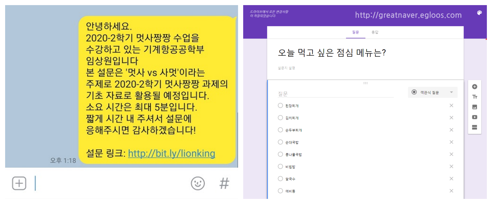

# $ur-money

## 1. 서비스 개요

> ### “설문지만 맡겨주시면 나머진 알아서 다 해드립니다”
>
> ### “설문조사하고 포인트 받아가세요”

### *누구나 한번쯤...*

- interviewer 에겐 설문 대상을 찾는 **수고를 줄이고** !

- interviewee 들은 보다 **편하게** 답변하고 **리워드**를 얻을 수 있도록 !!

- 구현 목표: 설문조사 + 캐시슬라이드

## 2. 핵심 기능

### 설문조사 중개 플랫폼

<h4>기존 설문조사 플랫폼들의 장점을 그대로 답습하되, <strong style="color:red">접근성</strong>에 주안점을 두자</h4>

#### To Interviewer (설문 의뢰인) 

- 사이트에서 설문조사를 **제작**, **배포**

- 연령, 성별, 거주지 등에 따른 **세분화된 설문 대상 설정** (like 페이스북 광고)
- 문항 개수, 종류에 따른 가격 책정
- 정해진 기한까지 설문 시행 **완료 보장** (ex. 8/12일까지 완료)
- 기한을 단축시키고 싶다면?  추가 금액 지불
- **bias-less** 
  - 내 주변인들은 나와 비슷한 배경을 가진 사람일 확률이 높다. 이는 설문조사의 표본과 모집단 사이의 편차를 만드는 요인!
  - 완전히 랜덤하게 설문을 시행함으로서 이에서 벗어날 수 있다!
  - but, 전자기기를 잘 사용하지 못하는 인원(ex. 노년층)은 여전히 설문이 어렵다.
  - 이를 해결하려면?? 오프라인 설문 병행?

#### To Interviewee (설문 대상자)

- 캐시슬라이드와 비슷한 인터페이스를 구현 (잠금 화면에서 접근 가능)

  - 기존의 설문조사들은 설문지 하나를 통채로 대답해야 했다  -->  몹시 귀찮음
  - 따라서, 문제 단위로 답변할 수 있도록!

- 답변에 따른 리워드 제공

  - 리워드
    - 포인트같은 개념, 1000원 단위로 현금으로 환전 가능
    - 1회 시행당 100원 정도의 리워드? 얼마가 적절할까
    - 댓글알바: 평균 댓글 1개당 200~350원 정도
  - 리워드는 **랜덤성**을 띈다. (흥미 유발을 위해)
  - 리워드를 많이 받으려면?
    - 설문에 **성실히 참여**할수록 높은 리워드를 받을 확률이 올라감
    - 등급제를 실시, 등급이 높을수록 더 많은 리워드 획득
    - **알림 설정**을 해둘 시 더 많은 리워드 획득
    - **잠금화면** 설정 해두면 더 많은 리워드 획득
    - 설문자가 입력하는 **개인 정보가 상세**할수록 더 많은 리워드를 제공한다.
  - 성의 없이 답변하는 interviewee 를 거를 수 있는 시스템 확보, 리워드 감소
    - deep learning 이용? 비슷한 질문이 왔을 때의 답변의 일관성?
    - 답변의 일관성을 확인하려면 dummy 질문을 섞어서 사용자의 경향을 데이터로 정리해야겠다.

  

- **접근성**이 핵심!! 사용이 편리해야 한다.

  - 여타 기능 없이 잠금화면, 또는 앱의 시작화면에서 바로 질문에 대한 답변할 수 있게끔
  - 답변시 쌓이는 리워드를 즉각 보여주기

가입시 입력한 정보

그전 설문에서 입력한 정보를 바탕으로 설문 제공

알림 설정 시 보상 제공

답변들의 일관성 분석 

성실히 답변하면 보상 증가(텍스트 감정 분석)

설문을 바탕으로 데이터 축적

기존의 설문조사에서는 **설문조사에 잘 답변하는 성향의 사람** 들의 의견이 가장 중요한 것처럼 보인다

그런데 이런 사람은 소수

오히려 귀찮아하는 다수의 의견을 들을 필요가 있다

사람들의 성향을 파악, 성향에 따라 분류 (MBTI ?)

**응답은 잘 하지 않지만 다수인 사람들**의 의견에 가중치 부여

## 3. 시장 조사

### Google 설문조사

- 접근성
  - 웹 기반 응답, 설문 제작
- 설문지를 만드는 과정, 수집한 데이터의 분석이 간편
- 그런데 어디에 돌리지?
- 인맥에 좌우?
- 내 주변에 있는 사람은 나와 비슷한 환경의 사람들일 가능성이 높다!  -->  **Bias 발생**

### 나우앤서베이([링크](https://www.nownsurvey.com/web/howtouse/nownsurvey_menual-1.html))

- 안드로이드 앱, 설문 참여시 적립금 제공(10000원부터 현금 환전 가능)

- 가격 정책

  - Basic 서비스

    - 질문 무제한, **무료** 응답, 설문 대상 30명으로 제한

  - One 서비스

    - 질문 무제한, **95,000원**, 300명의 응답, 

  - Standard 서비스

    - 질문 무제한, **월 98,000원 or 연 980,000원** 무제한 설문조사

    

### SurveyBilly ([링크](https://www.surveybilly.com/service))

- 안드로이드 앱 존재, 구현하려는 서비스와 가장 유사, 그러나 가격이 비싸다!
- 가격정책
  - 설문 입력 대행 10만원
  - 문항당 단가 책정 (https://www.surveybilly.com/cost)
    - 10문항에 300명 응답이면 204,000원
    - 30문항에 300명 응답이면 510,000원

### 캐시슬라이드

- 인터페이스를 유사하게!
- 광고 수익을 사용자에게 분배 -> 설문 수익을 사용자에게 분배
- 5만원을 모아야 환전 가능 -> 창렬
- 캐시슬라이드보다 돈 벌기 쉽게! 캐시슬라이드의 사용자를 가져오자

### 차별점을 잘 두어야 한다

왜 우리는 저런 서비스가 존재함에도 그동안 사용하지 않았던 것일까??

홍보의 부족? 구글 설문조사의 간편함? 관성?

1. 캐시슬라이드처럼 잠금화면상에서 설문조사가 가능하도록
2. 리워드가 쌓이는 것을 잘 시각화할 것, 게임처럼
3. 설문 조사 하나를 전부 할 필요 없이, **문항별로 질문** (오늘의 질문)
4. 더 많은 리워드와 랜덤성 (박리다매, 시장에서 영향력을 가질 때까지 수익률을 최소로)
5. 설문의 정확성 확보, 데이터 분석 서비스 추가 제공
6. 구글 설문조사 링크를 받아서 뿌려주는 대행 서비스 제공? 

## 4. 1순위 페르소나

## 5. 유저 시나리오

> 여기 단톡방은 어색해서 올리기 좀 그런데…. 
>
> 단톡방이 별로 없는데…
>
> 40대 사람들에게 설문을 돌리고 싶은데..
>
> 답변을 대충하지는 않을까..?
>
> 언제까지 완료될까…?

## 향후 계획...

### 추후 공신력 강화 version 추가 

학술자료에서 사용할 수 있을 정도의 공신력 확보. How?

### 확보한 사용자들의 성향을 이용해 적절한 광고 제공

- 광고를 보면 더 큰 리워드를 받을 수 있게끔. (광고주의 지불 금액을 소비자와 나누는 구조)

- 그러나, 광고는 annoying

- 대부분 광고는 그냥 넘기지 않나

- 실제로 도움이 될만한 정보를 제공할 수는 없을까?

