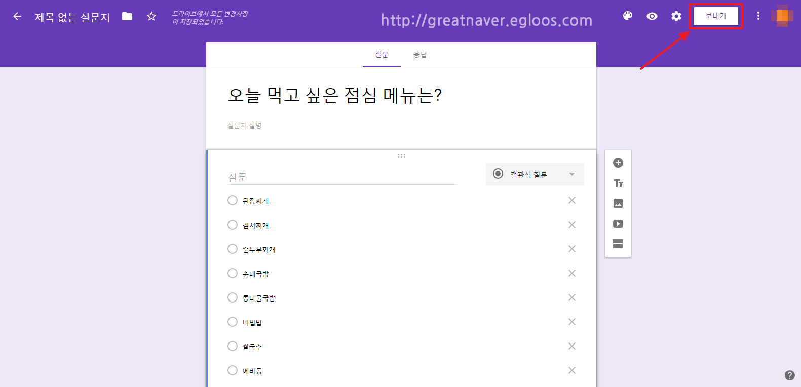

# surveySlide

해커톤을 향해! 

## 1. 일정

설입 커피나무(예정)

주 2회

월 7시, 토 7시? 정하기

[8월 8일] 해커톤 결과 발표(오전 10시), 고대 연합 아이티어톤(오후 2시부터)

## 2. 깃허브 사용

각자 이름으로 브랜치 파서 업로드 후 풀리퀘

[깃 커밋 메시지 작성 요령 (이건 그냥 참고용)](https://blog.ull.im/engineering/2019/03/10/logs-on-git.html)

## 3. 웹페이지 디자인

- 주요 기능
- 개인정보들을 처음에 회원가입할때 입력하기보다 설문의 형태로 입력하면 포인트 주게끔

### index.html

#### 로그인 전

- **로그인, 회원가입 페이지**

  
  - 회원가입
  - 로그인
  - 가격정책(pricing)

- 서비스소개(슬라이드해서 내려가면 아래처럼 소개 나오게끔)

  

#### 로그인 후

- **디자인**: 페이스북의 피드처럼 설문이 하나씩 올라오도록

- 메인에는 설문지 리스트
- 헤더
  - 소개 (intro.html)
  - 설문 제작 (forms.html)
  - 설문 결과 (result.html)
  - 드롭다운 메뉴
    - 내 프로필
      - 회원정보 수정 (mypage.html)
      - 내가 참여한 설문 (participated.html)
      - 내가 만든 설문 (made.html)
    - 충전/환전 (coin.html)
    - 설정 (settings.html)
    - 로그아웃 

### surveyMake.html

- 구글 설문조사 설문 제작 사이트 클론
- CRUD 활용하면 되지 않을까?
- ajax 이용해서 새로고침 없이 질문 목록 추가할 수 있도록

### mypage.html

- 회원정보 수정 페이지

### 나머지 페이지들 디자인도 여기에 추가! XD 활용해서 디자인!

### 디자인 시안

## 4. 나중에 할 것

앱 제작

잠금화면 단에서 설문 조사 가능하게 

자바 코데카데미 듣기?
